# Machine Learning Project Report - Hanuga Fathur Chaerulisma
## 📘 **PROJECT DOMAIN: Forecasting Rice, Coffee, and Palm Oil Production in ASEAN Using Univariate LSTM**
### 📌 **Background**

Agricultural commodities such as **rice, coffee, and palm oil** are strategic pillars of the economy in ASEAN countries. Indonesia, Vietnam, Thailand, and Malaysia are among the world’s top producers and exporters of these crops.

Despite their significance, production trends in these countries are often **highly volatile**, affected by seasonal variability and global dynamics. This makes it increasingly difficult to anticipate future supply levels with precision—posing a challenge for food security, trade strategy, and long-term policy planning.

With the availability of extensive historical data through the [World Food Production Dataset (Kaggle)](https://www.kaggle.com/datasets/rafsunahmad/world-food-production/data), it becomes feasible to use **data-driven forecasting models**, such as **Long Short-Term Memory (LSTM)** neural networks, to project production trends up to the year 2030 and compare country-level outputs over time.

> 📖 Read more: [ML Models: Food Security and Climate Change](https://link.springer.com/chapter/10.1007/978-3-031-08743-1_6) – Vuppalapati (2022) highlights the importance of machine learning models in projecting crop production in ASEAN under changing conditions.

---

### ❓ **Why This Problem Needs to Be Addressed**

1. **Long-Term Agricultural Planning**  
   Governments and agricultural planners need reliable forecasts to design effective food security strategies and optimize production infrastructure.

2. **Strategic Benchmarking Across ASEAN Nations**  
   Forecasting future outputs helps determine whether Indonesia will remain dominant in palm oil, or if Vietnam and Thailand may surpass others in coffee or rice production.

3. **Analyzing Global Production Trends**  
   Univariate LSTM models allow trend analysis of each commodity independently, providing insights into growth stagnation or potential yield increases.

> 📖 Related research: [Crop Yield Simulation Using Statistical and Machine Learning Models](https://theses.hal.science/tel-04009518/document) – Dinh (2022) demonstrates the effectiveness of production forecasting based solely on historical data using ML techniques.

---

### ⚙️ **How the Problem Will Be Solved**

The solution involves developing **univariate LSTM models** that utilize **only annual production quantities** as input—without any additional environmental or economic features. The approach focuses purely on historical production data from:

📦 [World Food Production Dataset (Kaggle)](https://www.kaggle.com/datasets/rafsunahmad/world-food-production/data)

**Implementation Steps:**

1. **Preprocess time series data** (1961–2023) for each commodity (rice, coffee, palm oil) and country (Indonesia, Vietnam, Thailand, Malaysia).
2. **Train separate LSTM models** per commodity per country.
3. **Forecast production for 2024–2030.**
4. **Visualize and compare** projected outputs between countries and across commodities.

> 📖 See also: [Predicting Agricultural Commodities with Machine Learning](https://arxiv.org/abs/2310.18646) – Tran et al. (2023) recommends LSTM for time-series forecasting in agriculture using production history alone.

Absolutely! Here is the **English version** of the **Business Understanding** section, based on your project: forecasting rice, coffee, and palm oil production in ASEAN using **univariate LSTM** and the **World Food Production Dataset**.

---

## 🧠 **Business Understanding**

---

### ❗ **Problem Statements**

**Problem Statement 1:**  
Historical trends in agricultural production across ASEAN countries are highly volatile. Without accurate forecasting, governments and agricultural stakeholders struggle to formulate long-term food and trade strategies.

**Problem Statement 2:**  
There is a lack of standardized production forecasts that compare Indonesia’s standing against other major ASEAN producers—Vietnam, Thailand, and Malaysia—for strategic crops like rice, coffee, and palm oil.

**Problem Statement 3:**  
Traditional forecasting techniques (e.g., basic statistics or linear regression) often fail to capture long-term and seasonal nonlinear patterns in agricultural time series data.

---

### 🎯 **Goals**

**Goal 1 (for Problem 1):**  
Develop accurate **univariate LSTM models** to forecast yearly production of rice, coffee, and palm oil from 2024 to 2030 using historical data (1961–2023) per country and crop.

**Goal 2 (for Problem 2):**  
Compare projected production outcomes among Indonesia, Vietnam, Thailand, and Malaysia for each commodity to quantitatively evaluate Indonesia’s competitive position.

**Goal 3 (for Problem 3):**  
Use LSTM to model non-linear, seasonal historical production trends, improving forecast accuracy over conventional models like moving average or linear regression.

---

### 💡 **Solution Statements**

**Solution 1:**  
Build **individual univariate LSTM models** for each commodity-country pair (12 total models) using annual production data from the [World Food Production Dataset (Kaggle)](https://www.kaggle.com/datasets/rafsunahmad/world-food-production/data).

To measure forecasting performance:

- **RMSE (Root Mean Squared Error)** – captures how much predictions deviate from actual values.
- **MAE (Mean Absolute Error)** – measures average absolute differences between predicted and actual values.

**Solution 2:**  
Compare and visualize the prediction result per total production for each commodity-country pair, allowing stakeholders to assess Indonesia’s competitive position in ASEAN.

Certainly! Here's the **English version** of the **📊 Data Understanding** section, tailored for your project using the Kaggle "World Food Production" dataset.

---

## 📊 **Data Understanding**

### 📌 **Dataset Description**

The dataset used for this project is titled **World Food Production (1961–2023)**, obtained from Kaggle. It contains annual food production data for various commodities (in tonnes) across more than 160 countries and regions. The data spans from **1961 to 2023**, making it well-suited for long-term time-series forecasting using machine learning techniques such as LSTM.

🔗 Dataset link: [World Food Production Dataset (Kaggle)](https://www.kaggle.com/datasets/rafsunahmad/world-food-production/data)


---

### 📄 **Variables in the Dataset**
 

| Variable Name                                   | Description                                                                 |
|------------------------------------------------|-----------------------------------------------------------------------------|
| `Entity`                                       | Country or region name (e.g., Indonesia, Vietnam, Thailand, Malaysia).     |
| `Year`                                         | Calendar year of data record (from 1961 to 2023).                           |
| `Maize Production (tonnes)`                    | Maize production in tonnes.                                                 |
| `Rice  Production ( tonnes)`                   | Rice production in tonnes – 🔍 key variable for this project.               |
| `Yams  Production (tonnes)`                    | Yams production in tonnes.                                                  |
| `Wheat Production (tonnes)`                    | Wheat production in tonnes.                                                 |
| `Tomatoes Production (tonnes)`                 | Tomato production in tonnes.                                                |
| `Tea  Production ( tonnes )`                   | Tea production in tonnes.                                                   |
| `Sweet potatoes  Production (tonnes)`          | Sweet potato production in tonnes.                                          |
| `Sunflower seed  Production (tonnes)`          | Sunflower seed production in tonnes.                                        |
| `Sugar cane Production (tonnes)`               | Sugar cane production in tonnes.                                            |
| `Soybeans  Production (tonnes)`                | Soybean production in tonnes.                                               |
| `Rye  Production (tonnes)`                     | Rye production in tonnes.                                                   |
| `Potatoes  Production (tonnes)`                | Potato production in tonnes.                                                |
| `Oranges  Production (tonnes)`                 | Orange production in tonnes.                                                |
| `Peas, dry Production ( tonnes)`               | Dry peas production in tonnes.                                              |
| `Palm oil  Production (tonnes)`                | Palm oil production in tonnes – 🔍 key variable for this project.           |
| `Grapes  Production (tonnes)`                  | Grape production in tonnes.                                                 |
| `Coffee, green Production ( tonnes)`           | Green coffee bean production – 🔍 key variable for this project.            |
| `Cocoa beans Production (tonnes)`              | Cocoa bean production in tonnes.                                            |
| `Meat, chicken  Production (tonnes)`           | Chicken meat production in tonnes.                                          |
| `Bananas  Production ( tonnes)`                | Banana production in tonnes.                                                |
| `Avocados Production (tonnes)`                 | Avocado production in tonnes.                                               |
| `Apples Production (tonnes)`                   | Apple production in tonnes.                                                 |

In this project, the focus is exclusively on **three key commodities**:
- `Rice  Production ( tonnes)`
- `Coffee, green Production ( tonnes)`
- `Palm oil  Production (tonnes)`

...and **four ASEAN countries**:
- **Indonesia**
- **Vietnam**
- **Thailand**
- **Malaysia**

---

### 🔍 **Exploratory Data Analysis (EDA)**

#### ✅ 1. **Missing Value Check**

I examined the dataset for null or missing values using code 
```python
 data.isnull().sum()
```
Below is the result of missing values in each column:

| Column                                        | Missing Values |
|-----------------------------------------------|----------------|
| Entity                                        | 0              |
| Year                                          | 0              |
| Maize Production (tonnes)                    | 0              |
| Rice  Production ( tonnes)                   | 0              |
| Yams  Production (tonnes)                    | 0              |
| Wheat Production (tonnes)                    | 0              |
| Tomatoes Production (tonnes)                 | 0              |
| Tea  Production ( tonnes )                   | 0              |
| Sweet potatoes  Production (tonnes)          | 0              |
| Sunflower seed  Production (tonnes)          | 0              |
| Sugar cane Production (tonnes)               | 0              |
| Soybeans  Production (tonnes)                | 0              |
| Rye  Production (tonnes)                     | 0              |
| Potatoes  Production (tonnes)                | 0              |
| Oranges  Production (tonnes)                 | 0              |
| Peas, dry Production ( tonnes)               | 0              |
| **Palm oil  Production (tonnes)**            | **0**          |
| Grapes  Production (tonnes)                  | 0              |
| **Coffee, green Production ( tonnes)**       | **0**          |
| Cocoa beans Production (tonnes)              | 0              |
| Meat, chicken  Production (tonnes)           | 0              |
| Bananas  Production ( tonnes)                | 0              |
| Avocados Production (tonnes)                 | 0              |
| Apples Production (tonnes)                   | 0              |

✅ **Conclusion**: The dataset is completely clean with **no missing values** in any column, including the three target variables: **rice**, **coffee**, and **palm oil**. 

#### ⚠️ 2. **Outlier Check**
Outliers in the production data of rice, coffee, and palm oil were visualized using box plots. The following Python code was used to generate the visual analysis:
```python
plt.figure(figsize=(15, 5))
for i, col in enumerate(commodities):
    plt.subplot(1, 3, i+1)
    sns.boxplot(x=df_filtered[col])
    plt.title(col.replace("Production", "").strip())
plt.tight_layout()
plt.show()
```
The results are below:
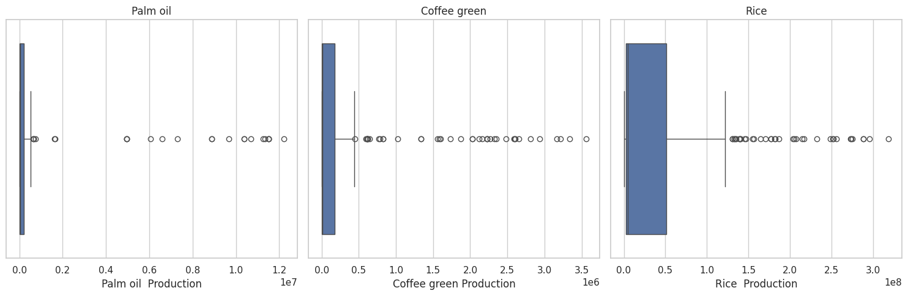

Great! Here's a clean and structured draft for your next section:

---

## 🧪 **Data Preparation**

---

### 🔍 1. **Filtering Countries and Commodities**

From the full **World Food Production Dataset**, the project filtered only the four ASEAN countries of interest—**Indonesia, Vietnam, Thailand, and Malaysia**—and focused on three key commodities:

- 🌾 Rice
- ☕ Coffee (green)
- 🌴 Palm Oil

Only the columns for `Entity`, `Year`, and the three selected commodity production values were retained. 

---

### 🧹 2. **Cleaning Column Names**
The dataset included commodity names with inconsistent formatting, such as extra spaces and unit annotations (e.g., " (tonnes)" or " ( tonnes)"), which needed to be cleaned to ensure consistency and avoid key errors in later processing.

The following cleaning steps were applied:

```python
# Clean column names by removing ' (tonnes)' from headers
df_filtered.columns = df_filtered.columns.str.replace(' \(tonnes\)', '', regex=True)
df_filtered.columns = df_filtered.columns.str.replace(' \( tonnes\)', '', regex=True)
df_filtered.columns = df_filtered.columns.str.replace('Coffee, green Production', 'Coffee green Production', regex=True)
```

This ensured consistent naming such as:
- `Palm oil Production`
- `Coffee green Production`
- `Rice Production`

---

### 🔁 3. **Log Transformation for Outlier Handling**

Agricultural production data often contains extreme values and non-linear growth patterns due to climate, demand spikes, or land expansion. Instead of removing outliers, this project used a **logarithmic transformation (`log1p`)** to stabilize variance while preserving all data points:

```python
df_transformed = df_filtered.copy()
for col in ['Palm oil Production', 'Coffee green Production', 'Rice Production']:
    df_transformed[col] = np.log1p(df_transformed[col])
```

The results can be seen in below image:
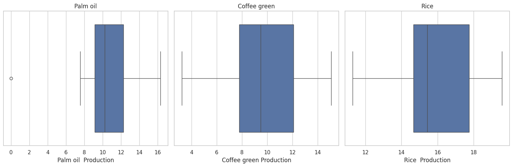

> 📌 `log1p(x)` is used instead of `log(x)` to safely handle zero values and avoid `log(0)` errors.

---

### 📉 4. **Normalization (MinMax Scaling)**

After log transformation, the features were scaled into the range [0, 1] using **MinMaxScaler**, which improves convergence when training LSTM models:

```python
scaler = MinMaxScaler()
df_scaled = scaler.fit_transform(df_transformed[commodity_columns])
```

Each commodity column was scaled separately to avoid distortion across countries.

---

### 📆 5. **Train-Test Split (Time-Aware)**

The dataset was split **chronologically**, not randomly, to preserve time series integrity.  
- **Training Set**: 80% of available years per country  
- **Testing Set**: remaining 20%, typically ending at **2021**, which is the latest year in the dataset.

---

### 📐 6. **Reshaping for LSTM Input**

LSTM models require input in the form of **[samples, timesteps, features]**. Using a `look_back = 5`, the project created sequences like:

```
Input: [1961, 1962, 1963, 1964, 1965]
Target: 1966
```

The following code was used:

```python
def create_sequences(series, look_back):
    X, y = [], []
    for i in range(len(series) - look_back):
        X.append(series[i:i+look_back])
        y.append(series[i+look_back])
    return np.array(X).reshape(-1, look_back, 1), np.array(y)
```

This structure allows the LSTM to learn temporal dependencies across 5-year windows of historical production data.

Awesome! Here's a clear and structured draft for your:

---

## 🤖 **Modeling**

The core objective of this project is to build time-series forecasting models that can accurately predict future agricultural production using historical data. For this purpose, the **Long Short-Term Memory (LSTM)** architecture was selected due to its ability to learn complex temporal dependencies in sequential data.

---

### 🔍 **Why LSTM?**

Traditional statistical methods (like ARIMA or exponential smoothing) often struggle with:
- Non-linear trends
- Long-term dependencies
- Volatility in agricultural production data

LSTM, a variant of Recurrent Neural Networks (RNN), is well-suited for time-series forecasting due to its use of memory cells that retain information across longer sequences [1].

---

### ⚙️ **Model Configuration**

For each country–commodity pair, a separate **univariate LSTM model** was trained using 5-year windows of annual production data (after log transform and normalization).

- **Input shape**: `(samples, 5, 1)`  
- **Layers**:
  - `LSTM(units=50, activation='relu')`
  - `Dense(units=1)`
- **Loss function**: Mean Squared Error (MSE)  
- **Optimizer**: Adam  
- **EarlyStopping**: Enabled with `patience=10` and `min_delta=0.001` to prevent overfitting

```python
model = Sequential()
model.add(LSTM(50, activation='relu', input_shape=(look_back, 1)))
model.add(Dense(1))
model.compile(optimizer='adam', loss='mse')
```

---

### 🔁 **Training Procedure**

Each LSTM model was trained using the first 80% of the available sequence, with the remaining 20% used for testing. EarlyStopping was applied based on training loss:

```python
early_stop = EarlyStopping(
    monitor='loss',
    patience=10,
    min_delta=0.001,
    restore_best_weights=True,
    verbose=1
)

model.fit(
    X_train, y_train,
    epochs=100,
    verbose=1,
    callbacks=[early_stop]
)
```

---
Great! Below is the **updated `## Evaluation`** section including the full table of results and analysis based on your actual RMSE output from the image:

---

## 📊 **Evaluation**

To assess the accuracy of the univariate LSTM models, this project utilized two regression evaluation metrics: **Mean Squared Error (MSE)** and **Root Mean Squared Error (RMSE)**. Both metrics were calculated after reversing the log transformation and scaling to reflect real production values in tonnes.

---

### 🎯 **Evaluation Metrics**

| Metric | Description |
|--------|-------------|
| **MSE** | Measures the average squared differences between actual and predicted values. Sensitive to large errors. |
| **RMSE** | The square root of MSE. Expressed in the same unit as the original target variable, making it more interpretable. |

Here's how the evaluation was performed:
```python
# Inverse transform
y_pred_inv = scaler.inverse_transform(y_pred)
y_true_inv = scaler.inverse_transform(y_true.reshape(-1, 1))

# Compute errors
mse = mean_squared_error(y_true_inv, y_pred_inv)
rmse = mse ** 0.5
```

---

### 📄 **Model Performance**

| Country     | Commodity          | MSE       | RMSE     |
|-------------|--------------------|-----------|----------|
| Indonesia   | Palm oil           | 0.429887  | **0.656** |
| Indonesia   | Coffee (green)     | 0.025748  | **0.160** |
| Indonesia   | Rice               | 0.109882  | **0.331** |
| Vietnam     | Palm oil           | 7.281894  | **2.698** |
| Vietnam     | Coffee (green)     | 7.291881  | **2.700** |
| Vietnam     | Rice               | 0.033783  | **0.184** |
| Thailand    | Palm oil           | 0.115400  | **0.340** |
| Thailand    | Coffee (green)     | 1.330307  | **1.153** |
| Thailand    | Rice               | 1.506521  | **1.227** |
| Malaysia    | Palm oil           | 2.856282  | **1.690** |
| Malaysia    | Coffee (green)     | 0.413595  | **0.643** |
| Malaysia    | Rice               | 0.059875  | **0.245** |

---

### 🔍 **Insights & Interpretation**

- 🇮🇩 **Indonesia** achieved the **best performance overall**, with **Coffee green** production forecast showing the **lowest RMSE = 0.160**, followed by rice and palm oil.
- 🇻🇳 **Vietnam’s palm oil and coffee models** had the **highest RMSE** (≈2.7), indicating a greater degree of production volatility or irregular historical patterns.
- 🇲🇾 Malaysia’s palm oil RMSE is relatively high (**1.69**), suggesting noisy or less predictable production patterns, while **rice was well-predicted** (RMSE = 0.245).
- 🇹🇭 Thailand models produced moderate accuracy, with RMSE values between 0.3 and 1.2.

---

### 📈 **Visual Evaluation**

Forecasts were plotted against real production values to visualize model performance. Most models captured long-term trends accurately, though some underpredicted or overpredicted at extreme ends (notably in Vietnam and Malaysia coffee/palm oil).

Indonesia's model evaluation:
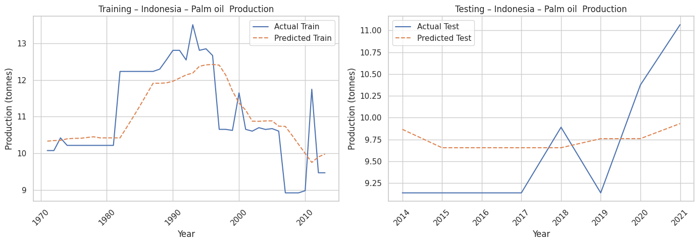
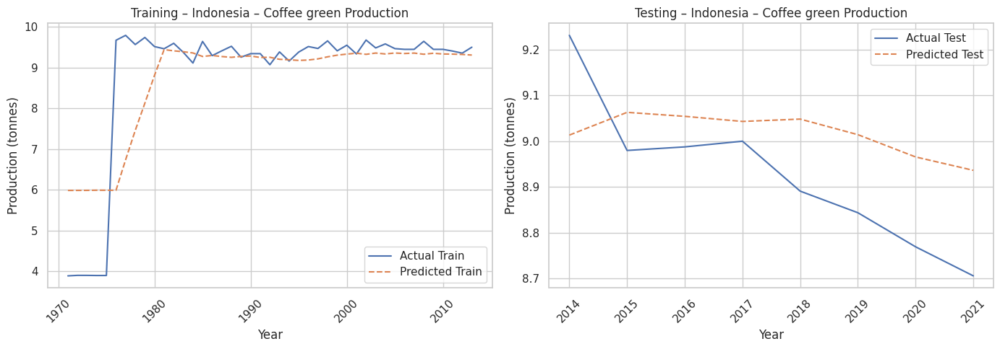
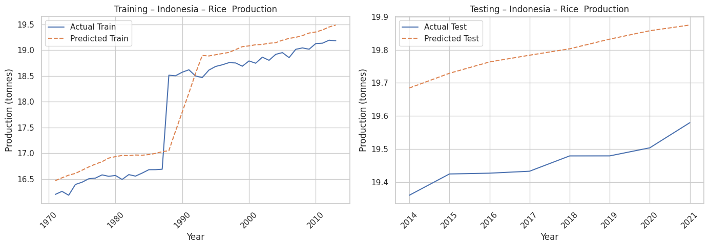

Malaysia's model evaluation:
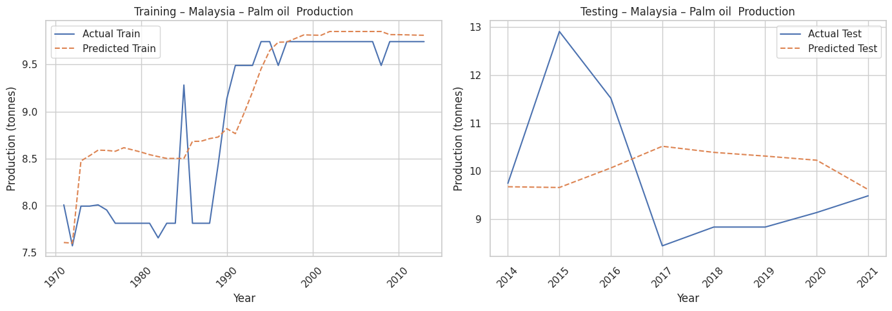
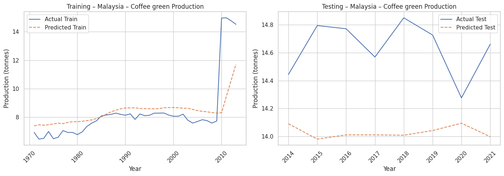
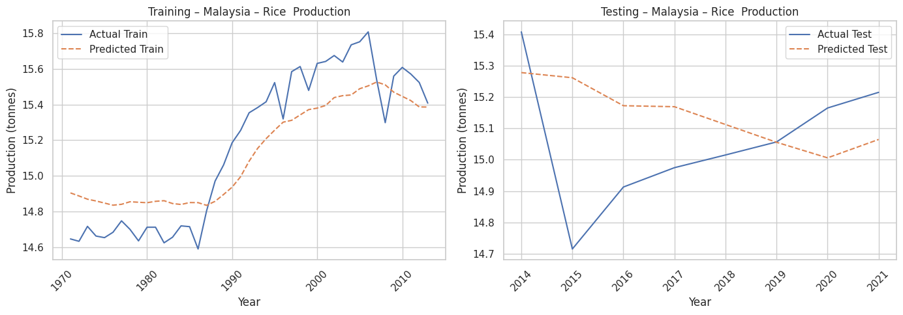

Vietnam's model evaluation:
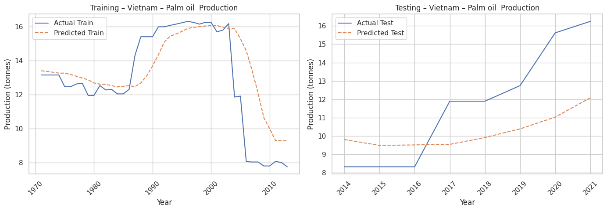
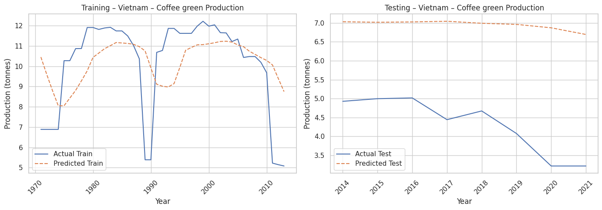
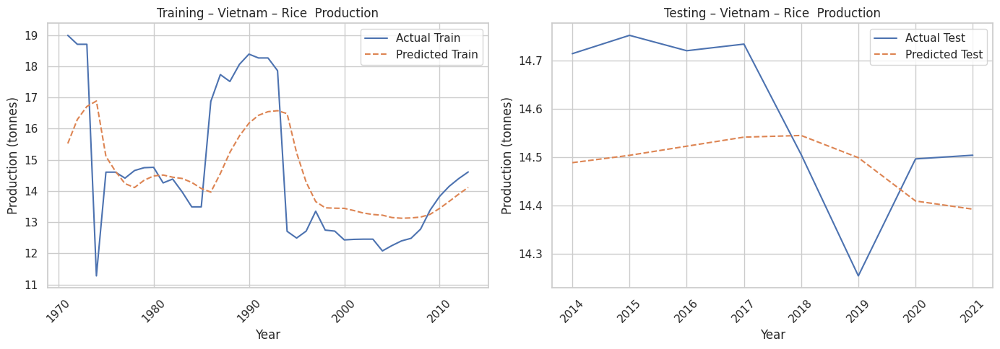

Thailand's model evaluation:
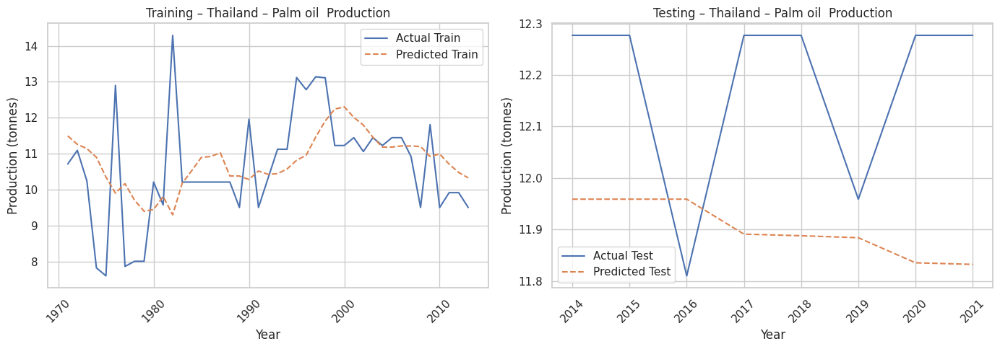
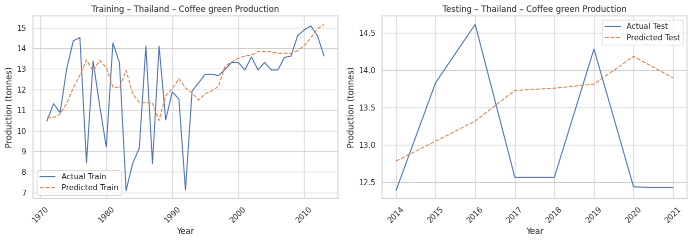
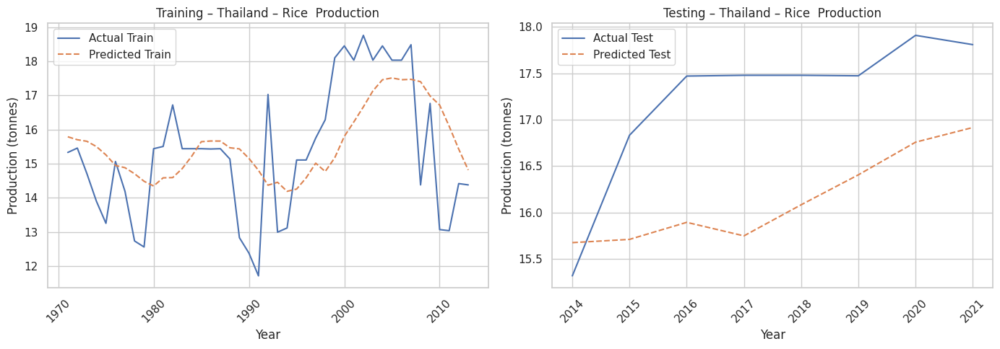

---

### 📊 **Forecasting Results**
#### Bar chart visualizations 
It's created to compare projected production levels across the four ASEAN countries in 2030.
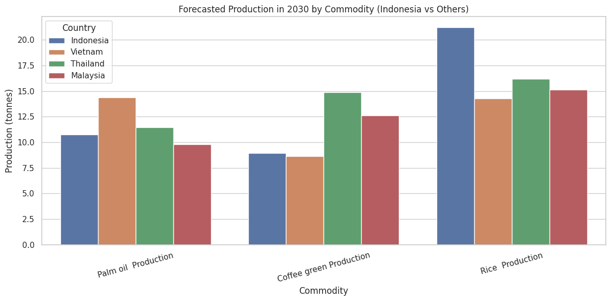
#### Multiline Time Series Forecast Chart
The final forecasts for each commodity from 2022 to 2030 were generated using the trained models. It's useful to compare projected production levels across the four ASEAN countries.
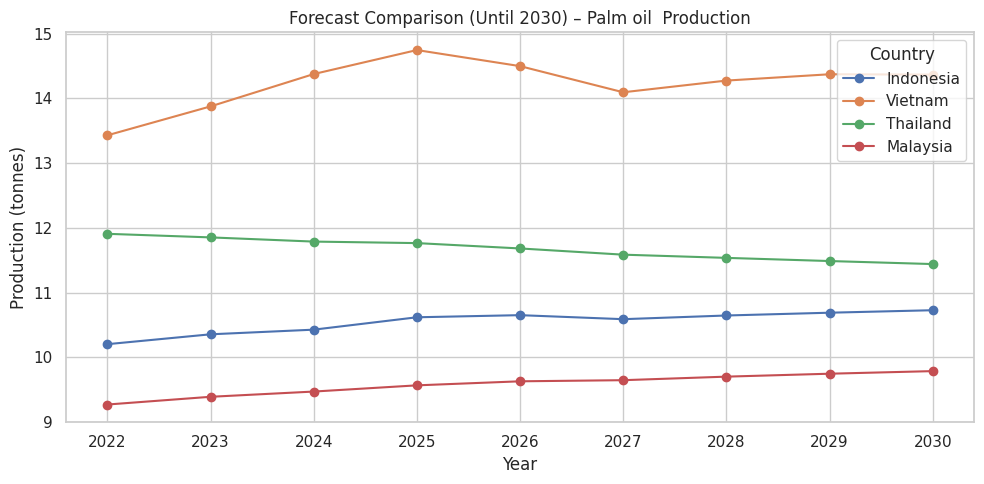
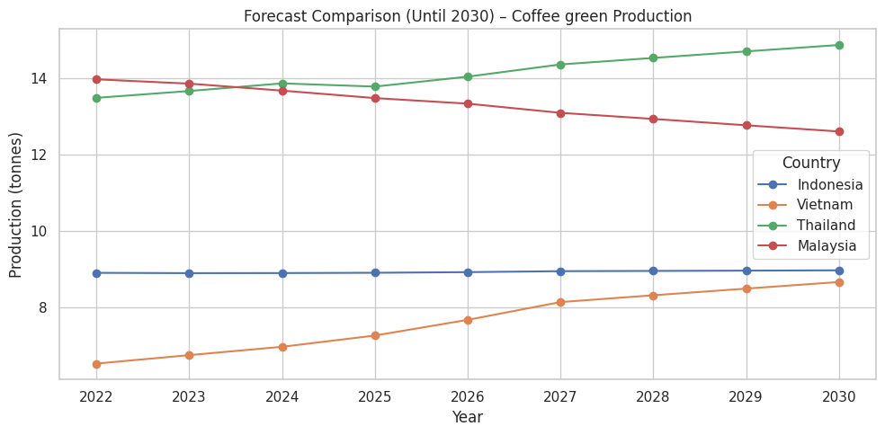
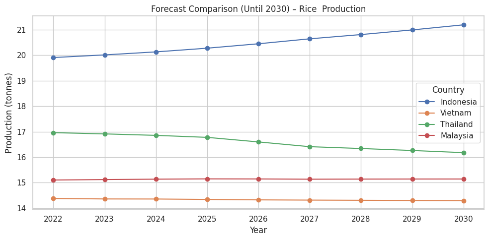

